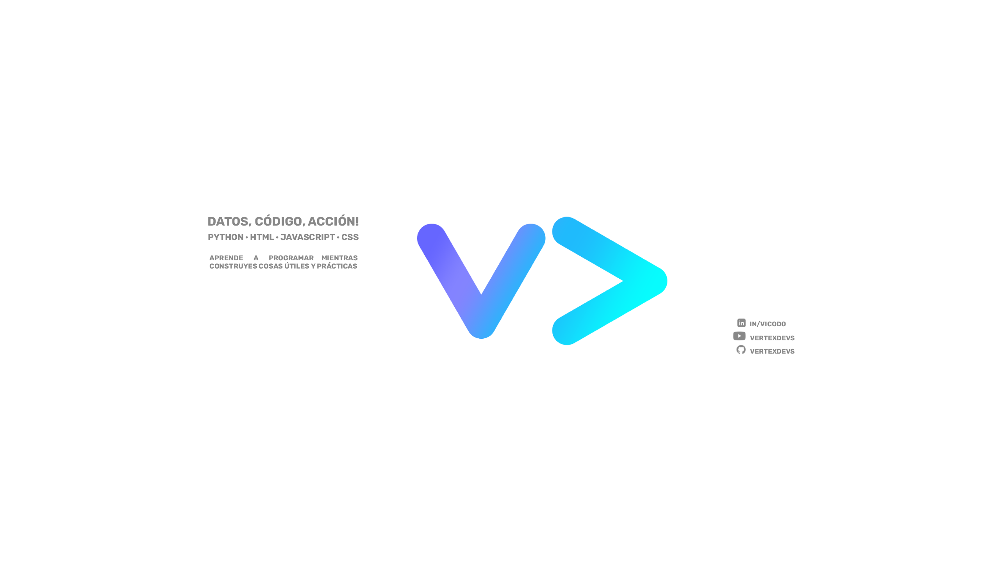

## ¡Bienvenido a VexelDevs! 👋

Soy **Ingeniero en Geomática** con **Máster en Geomática y Geoinformación**, y actualmente trabajo como **BIM Modeler** en infraestructuras hidráulicas.

---

Estoy en GitHub para **difundir conocimiento y compartir contenido útil**, enseñando a programar y mostrando workflows reales que uso en mi día a día.  

Trabajo con **gran cantidad de información y datos complejos**, por lo que mis proyectos buscan **organizar, automatizar y simplificar procesos** para que otros puedan aprender haciendo.

Aquí comparto **scripts, proyectos y tutoriales** aplicados mayoritariamente a estos campos:

---

### Contenido que encontrarás

En este repositorio encontrarás **material organizado por tecnologías y disciplinas**, para que puedas seguirlo de forma progresiva y práctica:

---

### Cómo está organizado este repositorio

- **Proyectos completos:** workflows aplicados a BIM, GIS e infraestructura hidráulica, listos para clonar y probar.  
- **Scripts y automatizaciones:** código reutilizable que simplifica tareas repetitivas y análisis de datos complejos.  
- **Tutoriales paso a paso:** explicaciones detalladas para que aprendas haciendo, desde lo básico hasta técnicas avanzadas.  
- **Tips de buenas prácticas:** organización de datos, optimización de procesos y uso de herramientas open source.

---

Mi objetivo con **VexelDevs** es que **aprender programación deje de ser teórico** y se convierta en algo **real y aplicable**, usando ejemplos y proyectos que reflejan cómo trabajo día a día.  

¡Sigue explorando, probando los scripts y creando tus propios proyectos!