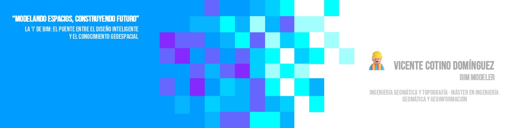

## ¡Bienvenido a VexelDevs! 👋

Soy **Ingeniero en Geomática** con **Máster en Geomática y Geoinformación**, y actualmente trabajo como **BIM Modeler** en infraestructuras hidráulicas.

---

Estoy en GitHub para **difundir conocimiento y compartir contenido útil**, enseñando a programar y mostrando workflows reales que uso en mi día a día.  

Trabajo con **gran cantidad de información y datos complejos**, por lo que mis proyectos buscan **organizar, automatizar y simplificar procesos** para que otros puedan aprender haciendo.

Aquí comparto **scripts, proyectos y tutoriales** aplicados mayoritariamente a estos campos:

---

